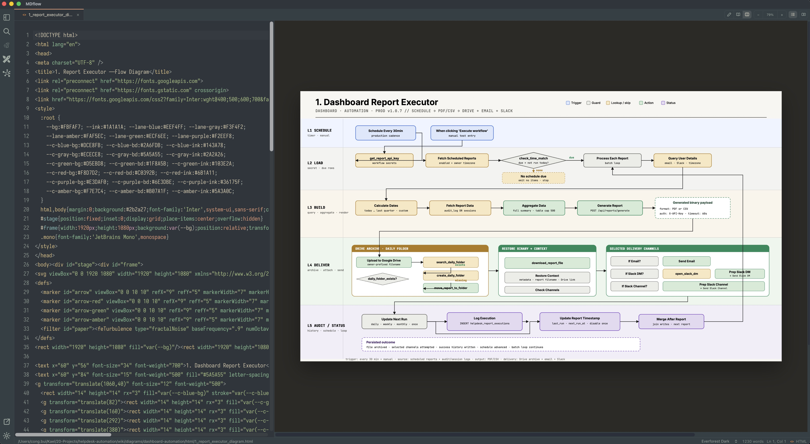

# MDflow

A fast, lightweight markdown editor built with Tauri 2 + Rust and a plain-TypeScript
frontend. MDflow is an IDE-style workspace for markdown: a file explorer, split
  windows, a command palette, rich preview (mermaid, math, raw HTML), a built-in AI
panel, a PDF reader, editable Excalidraw and mindmap boards, and document export.

**License:** MIT · **Identifier:** `com.kael.mdflow`

> Clean-room, independent project. Written from scratch; not derived from any
> GPL-licensed editor.



## Features

- **Editor** — CodeMirror 6 with markdown highlighting, soft-wrap, line numbers, and
  per-document undo. Markdown tabs include a formatting toolbar; standalone HTML
  tabs use proper HTML syntax highlighting. Live preview has a 300 ms debounce.
- **Workspace shell** — activity bar, toggleable file explorer with full CRUD
  (create, rename, duplicate, delete-to-trash, reveal in Finder), and resizable panels.
- **Native multi-window** — create independent macOS windows from View or the Dock;
  each has its own tabs, Explorer workspace, AI panel, and optional Main/Sub split.
- **Main/Sub split** — each native window can show Main and Sub document panes with
  independent tabs and type-aware view modes.
- **Tabs** — multi-document tabs with dirty markers, pinning, and right-click actions
  (split, move between windows, close variants, copy paths).
- **Command palette** — `⌘K` to fuzzy-find files or run commands.
- **Search** — in-editor find (`⌘F`) and **Find in Folder** (`⌘⇧F`): content search
  across text files plus the text inside `.mind` / `.excalidraw` drawings, with
  results grouped by file (click to open at the line).
- **Customizable keyboard shortcuts** — the **Keys** settings tab (or **View →
  Keyboard Shortcuts**) lists every command; rebind, reset, or restore defaults.
- **Finder drag/drop** — open files by dropping onto a document pane, copy them
  into Explorer folders/file locations, or drop onto the AI panel to attach them.
- **Compare** — select two files and view a side-by-side diff.
- **Recovery & version history** — unsaved edits are continuously drafted in the
  background and offered back after a crash or quit (restore / discard banner on
  launch), without changing the explicit-save model. MDflow detects when an open file
  changes on disk (reload when clean, conflict prompt when dirty, overwrite
  protection on save) and keeps per-file local snapshots on save plus manual
  snapshots, browsable in a version-history panel with Compare and Restore.
- **Rich preview** — [mermaid](https://mermaid.js.org) diagrams, [KaTeX](https://katex.org)
  math (`$…$`, `$$…$$`), and raw HTML. Standalone HTML previews measure their
  rendered content so wide documents scroll in the preview pane without trapping
  overflow inside the iframe.
- **PDF reader** — open `.pdf` files rendered with pdf.js, with fit-to-width reset,
  zoom, horizontal wheel navigation, and Space/middle-mouse panning for enlarged
  pages while preserving text selection and find.
- **Excalidraw boards** — open and edit `.excalidraw` files in a focused full-pane
  canvas. Boards use the normal tab, save, dirty-close, and session workflows.
- **Mindmap boards** — open and edit `.mind` files (jsMind) with an on-board toolbar:
  add / rename / delete nodes, and format a selected node's shape (rect / rounded /
  pill / circle), fill & text color, font size, and bold. Styling is saved in the
  `.mind` file. Select several nodes at once with shift/⌘-click or a marquee drag and
  delete them in one step (Delete/Backspace or the toolbar); Escape clears selection.
- **AI panel** — a right-side assistant with a **Chat** tab (provider + permission-mode
  selectors, document/selection context, file attachments via 📎 / drag-drop /
  `@`-mention, streamed replies, copy / insert-at-cursor / apply-as-diff) and a
  **Terminal** tab (an embedded terminal running an agent CLI, with a live picker and
  configurable font/size). Providers offer a connection test; document and attachment
  text is passed inside an untrusted boundary; and apply-as-diff edits are bound to
  their originating tab and selection, so a reply is rejected if that source has
  changed or closed instead of patching the wrong document.
- **AI quick actions** — Proofread / Rewrite / Summarize / Generate outline from the
  command palette (`⌘K`) or the editor right-click menu, acting on the selection (or
  the whole document). Proofread and Rewrite replace text through the diff review;
  Summarize and Generate outline stream into the panel. Applying an AI edit snapshots
  the file first (revert from Version History), and CLI agent runs show a changed-files
  summary afterward. The quick-actions model is set in Agent ▸ Models.
- **Settings** — an in-app panel (Theme, Font, Size, Session, Update, Agent) plus raw
  `settings.json` / `agent.json` for advanced edits.
- **Updates** — manual checks from Help and optional once-daily automatic checks;
  installation always requires confirmation.
- **Themes** — System, Light, Dark, Catppuccin Mocha, Everforest Dark, Nord — recoloring
  the whole UI including editor syntax.
- **Export** — PDF and DOCX via pandoc (+ typst for PDF), HTML, and PNG / JPG of the
  rendered preview.
- **Zoom** — editor, HTML preview, and PDF preview zoom in / out, persisted where
  applicable.

## Requirements

- **Node.js** and **Rust** (stable) with the Tauri 2 prerequisites for your platform.
- **Export only:** [pandoc](https://pandoc.org) and [typst](https://typst.app) —
  install with `brew install pandoc typst`. They are located at runtime, not bundled.
- **AI:** a local OpenAI-compatible server (e.g. [Ollama](https://ollama.com) or
  LM Studio) and/or an agent CLI (Claude Code, Codex, OpenCode, Pi). MDflow resolves
  your login-shell `PATH` to find CLIs installed via Homebrew, npm, etc.

## Getting started

```bash
npm install
npm approve-scripts esbuild fsevents   # one-time: allow native postinstalls
npm run tauri dev                      # run the desktop app (hot reload)
```

### Build a release bundle

```bash
npm run tauri build
```

### Tests & checks

```bash
npm run test                 # Vitest unit tests (pure functions)
npm run build                # type-check + Vite production build
cd src-tauri && cargo test   # Rust unit tests
cd src-tauri && cargo check  # fast backend compile-check
```

## Configuring the AI panel

AI providers are configured in `agent.json` (in the app config directory; open it from the
gear menu → **Open agent.json**). The Agent panel has **CLI Agents** and **Models** tabs;
Models combines local and hosted endpoints. OpenAI, Anthropic, and OpenRouter
templates ship by default. Each provider is one of:

- `http` — an OpenAI-compatible endpoint: `{ "type": "http", "baseUrl": "http://localhost:11434/v1", "model": "llama3" }`
- `command` — a headless agent CLI: `{ "type": "command", "run": "claude -p {prompt}" }`
  (`{prompt}` is replaced with your message plus document context). An optional
  `bypassRun` is used when **Bypass approvals** mode is selected.

`terminals` entries define interactive commands for the Terminal tab.

> **Security note:** API keys are stored in your macOS Keychain under service
> `com.kael.mdflow`, never in `agent.json`.

## Architecture

Tauri 2 + Rust native shell; plain-TypeScript frontend (no framework) wired by a thin
`main.ts`, with one responsibility per file. Pure logic (fuzzy match, settings parsing,
diff, provider request/parse) is unit-tested; UI, streaming, PTY, and binary-export
paths are manually smoke-tested.

```
src/
  main.ts          bootstrap + wiring + hotkeys + preview debounce
  editor.ts        CodeMirror 6 (multi-document, selection/replace API)
  markdown-format.ts pure Markdown toolbar transformations
  preview.ts       markdown-it pipeline (+ KaTeX rule, raw HTML)
  render-extras.ts mermaid + KaTeX post-processing
  windowview.ts    per-window component (tabs, toolbar, panes, status)
  explorer.ts      file tree + context menus + CRUD
  palette.ts       ⌘K command/file overlay
  search.ts        Find in Folder results panel
  keymap.ts        shortcut registry + accelerator match/format
  settingspanel.ts in-app settings panel (incl. Keys tab)
  settings.ts      settings.json model (themes, fonts, sizes, session, keymap)
  updater.ts       manual and once-daily signed update checks
  compareview.ts   side-by-side diff surface
  pdfview.ts       pdf.js viewer
  excalidraw-document.ts Excalidraw JSON validation and serialization
  excalidrawview.ts lazy board-only runtime loader
  mindmap-document.ts jsMind node_tree validation and serialization
  mindmap-style.ts pure per-node style helpers (shape/color/size)
  mindmap-selection.ts pure multi-select math (toggle, marquee, subtree filter)
  mindmapview.ts   lazy jsMind board (node + format toolbars, multi-select, screenshot)
  recovery-policy.ts pure recovery decisions (ids, conflict, retention)
  recovery.ts      draft autosave, crash restore, external-change detection, snapshots
  historyview.ts   version-history panel (list / compare / restore)
  hash.ts          shared deterministic text hash (recovery + AI edit binding)
  ai/              AI panel: aisettings, providers, client, conversation, diff,
                   edit-binding, terminal, panel
src-tauri/src/
  lib.rs           Tauri builder: command registry + plugins
  files.rs         file IPC, settings/ai-settings files, recursive walk
  recovery.rs      atomic draft/snapshot store + file_stat
  ai.rs            command-provider streaming
  secrets.rs       API keys in the OS keychain (keyring crate)
  pty.rs           embedded-terminal PTY
  export.rs        pandoc/typst export
  menu.rs          native menu bar
  native_windows.rs independent Tauri window creation and focused-window routing
  macos_dock.rs     macOS Dock context-menu New Window integration
```

Excalidraw 0.18.0 and its React boundary are shipped as a pinned, self-contained
module under `public/vendor/excalidraw`. It is requested only when a board opens, so
the plain-TypeScript startup bundle does not load React.

## Configuring signed updates

The update UI is active, but release checks require a signed feed. Set
`plugins.updater.endpoints` and `plugins.updater.pubkey` in
`src-tauri/tauri.conf.json`, then publish Tauri updater artifacts and `latest.json`
with each release. Until those values exist, **Help → Check for Updates** reports
that the build is not configured.

## License

MIT — see [LICENSE](LICENSE). Bundled third-party libraries are listed in
[THIRD-PARTY-NOTICES](THIRD-PARTY-NOTICES).
